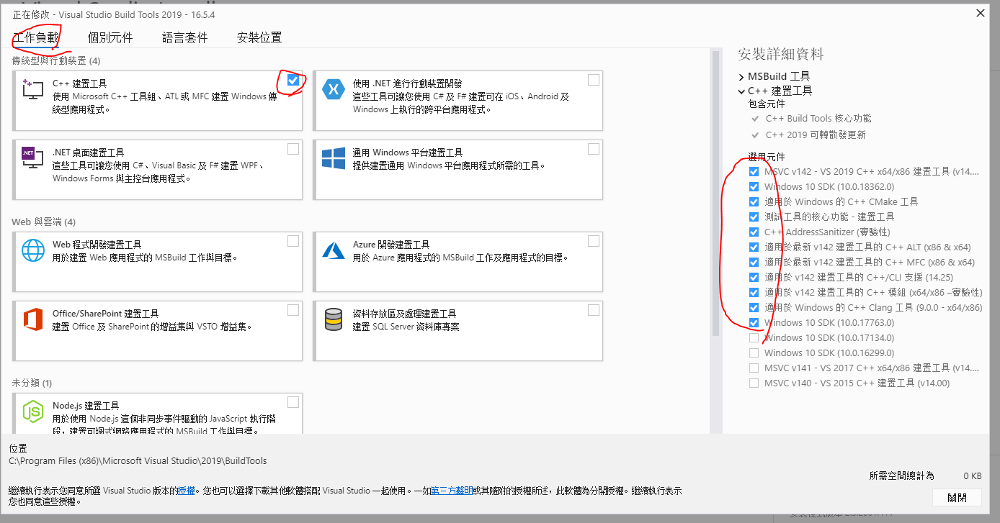
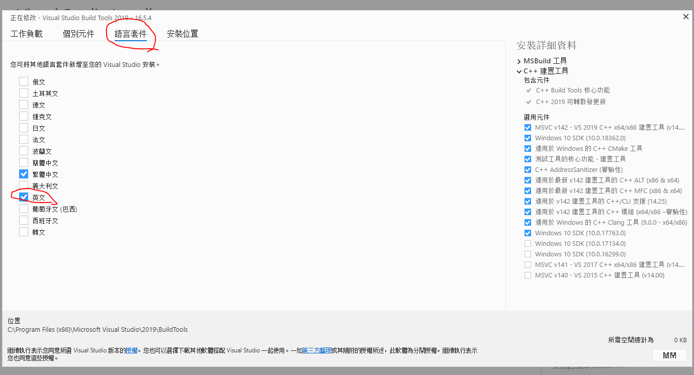

# Conf vcpkg

## on Windows

### Before start

Check following packages are installed

1. git
2. Visual Studio 2019(MFC, ATL, build tools)




### Install vcpkg

Run as Administrator(Recommand using powershell):

``` bash
cd C:/SDKs
git clone https://github.com/microsoft/vcpkg.git
cd vcpkg
.\bootstrap-vcpkg.bat
.\vcpkg integrate install
```

### Set following env.

```
VCPKG_DEFAULT_TRIPLE	x64-windows
VCPKG_ROOT	C:\SDKs\vcpkg
VCPKGRS_DYNAMIC	1
```

### Install qt5 with vcpkg

``` bash
vcpkg install qt5:x64-windows
```

### Check these path in your PATH of enviroment variable

``` text
C:\SDKs\vcpkg\installed\x64-windows\bin
C:\SDKs\vcpkg\installed\x64-windows\debug\bin
```

### Build this project

``` bash
mkdir build

cd build

cmake -G "Visual Studio 16 2019" -A x64 -DCMAKE_CONFIGURATION_TYPES="Debug;Release" -DCMAKE_TOOLCHAIN_FILE=C:/SDKs/vcpkg/scripts/buildsystems/vcpkg.cmake ..

cmake --build . --config Debug
```

### Update vcpkg

```
cd ~/path/to/vcpkg/root
git pull
.\bootstrap-vcpkg.bat
vcpkg upgrade  --no-dry-run
```

## Ref

[I-refed](https://github.com/mattfife/QtQuick-with-cmake)
